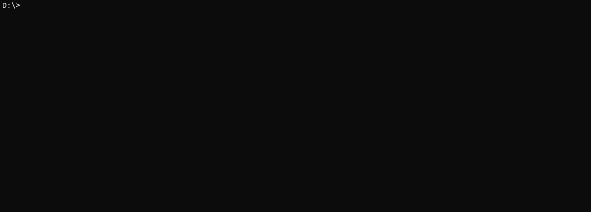

 

# Plexify - A Spotify to Plex Synchronization
This application synchronizes your Spotify playlists with your Plex music library. It converts Spotify URIs to Plex playlists and updates them at a specified interval. Download missing tracks with spotdl.

# Disclaimer

This project is intended for educational and demonstration purposes only. It is not intended to be used for illegal activities, including but not limited to the unauthorized downloading or distribution of copyrighted music or other media.

The author of this project does not condone or support illegal activities. The author is not responsible for any misuse of this project for illegal activities, and will not be held liable for any damages or legal issues that arise from such misuse.

Users are responsible for ensuring that their use of this project complies with all applicable laws and regulations, including copyright laws. If you choose to use this project, you do so at your own risk.

## Features

- Synchronizes all public playlists of a Spotify user
- Synchronizes specific public Spotify playlists
- Only creates playlists on Plex for songs that exist in your Plex library
- Downloads songs not found in Plex library for local storage and playback
- Supports setting synchronization interval
  

## Setup

To set up the application, you need to configure several environment variables:

- `SPOTIPY_CLIENT_ID`: Your Spotify client ID. You can create one [here](https://developer.spotify.com/dashboard/login).
- `SPOTIPY_CLIENT_SECRET`: The client secret of your Spotify client ID.
- `SPOTIPY_PATH`: The path of your music archive. SpotDL will download the tracks to this location under a folder named as the Spotify playlist.
- `PLEX_URL`: The URL of your Plex server, e.g., `http://plex:32400`.
- `PLEX_TOKEN`: Your Plex token. You can find it by following [these instructions](https://support.plex.tv/articles/204059436-finding-an-authentication-token-x-plex-token/).
- `SPOTIFY_URIS`: A comma-separated list of the Spotify URIs you want to import. You can specify either a user's URI to import all public playlists owned by the user, or a playlist URI to import a specific public playlist. For example: `spotify:user:sonosplay,spotify:user:sonosplay:playlist:6nQjiSQhdf84s2AAxweRBv`.
- `SECONDS_TO_WAIT`: The number of seconds to wait between synchronizations.

The following URI's are supported:
* A user's URI which will import all public playlists a user owns: `spotify:user:sonosplay`
* A playlist URI which imports a specific playlist (must be public): `spotify:user:sonosplay:playlist:6nQjiSQhdf84s2AAxweRBv`

Playlists will only be created on Plex if your Plex instance has at least one of the songs. Only songs found on your Plex will be created in the Plex Playlilst

## Usage

After setting up the environment variables, you can run the application. It will start synchronizing your Spotify playlists with your Plex library at the specified interval.

Please note that playlists will only be created on Plex for songs that exist in your Plex library. If a song from a Spotify playlist is not found in your Plex library, the application will attempt to download it for local storage and playback.

## Docker

This application is available as a Docker image.

## To Do
- [ ] Throttle API calls to avoid banning
- [ ] Add the possibility to create a Plex Playlist from "Liked Songs"
- [ ] Add auto-rating to 5 stars at playslist creation
- [ ] Add selection for folder hieranchy (follow Plex folder structure or create a personal)
- [ ] Add Beets to force metadata and folder hierarchy
- [ ] Create standalone UI for Windows,MacOS
